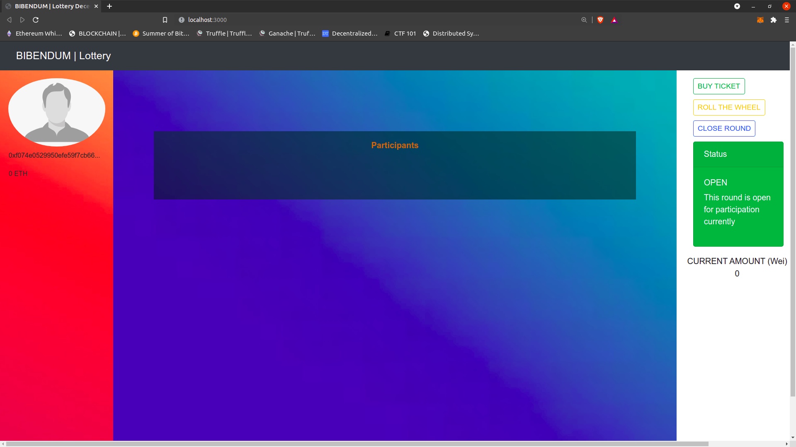
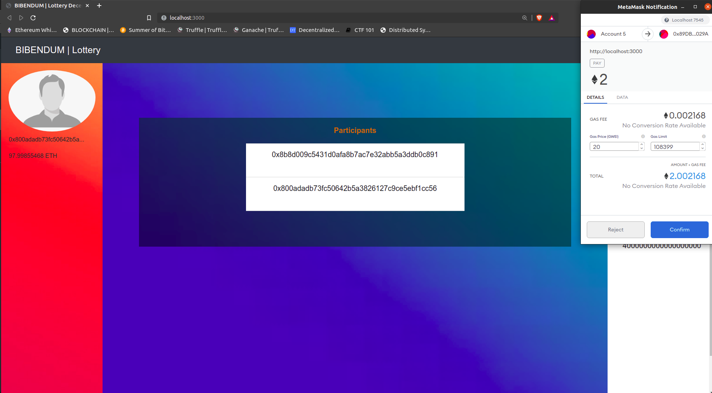
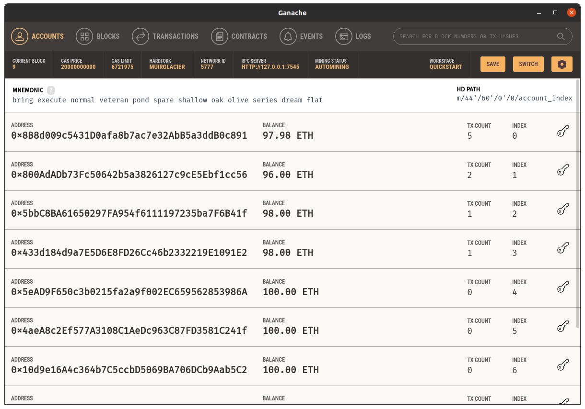
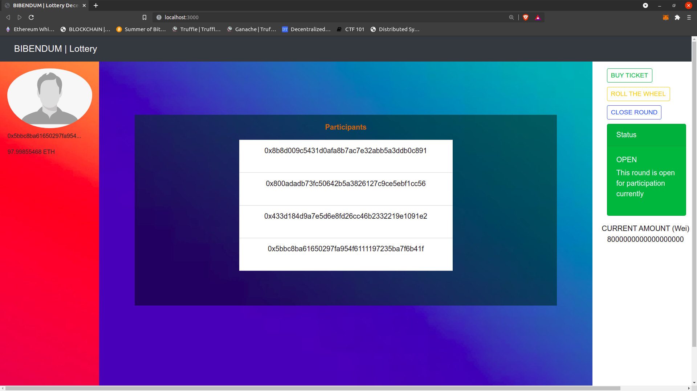
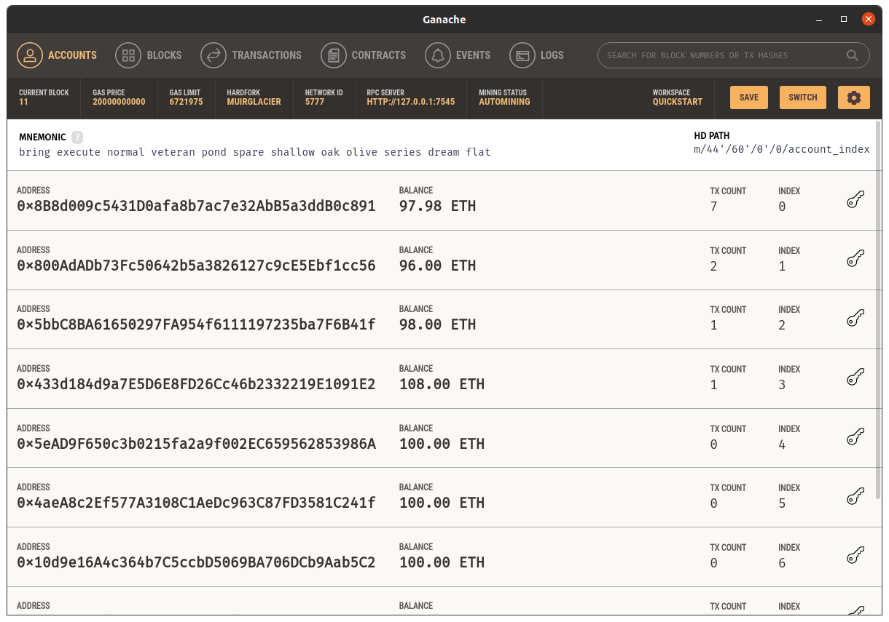

<!-- [![Contributors][contributors-shield]][contributors-url]
[![Forks][forks-shield]][forks-url]
[![Stargazers][stars-shield]][stars-url]
[![Issues][issues-shield]][issues-url]
[![MIT License][license-shield]][license-url]
[![LinkedIn][linkedin-shield]][linkedin-url] -->


<br />
<p align="center">
  <a href="https://github.com/vs666/Sentinel">
    
  </a>

  <h3 align="center">BIBENDUM</h3>

  <p align="center">
    Trustless lottery system on Ethereum.
    <br />
    <br />
    <br />
    <!-- <a href="https://github.com/vs666/Sentinel">View Demo</a> -->
    ·
    <a href="https://github.com/vs666/BIBENDUM/issues">Report Bug</a>
    ·
    <a href="https://github.com/vs666/BIBENDUM/issues">Request Feature</a>
  </p>
</p>


<!-- TABLE OF CONTENTS -->
<details open="open">
  <summary><h2 style="display: inline-block">Table of Contents</h2></summary>
  <ol>
    <li>
      <a href="#about-the-project">About The Project</a>
      <ul>
        <li><a href="#built-with">Built With</a></li>
      </ul>
    </li>
    <li>
      <a href="#getting-started">Getting Started</a>
      <ul>
        <li><a href="#prerequisites">Prerequisites</a></li>
        <li><a href="#installation">Installation</a></li>
      </ul>
    </li>
    <li><a href="#usage">Usage</a></li>
    <li><a href="#roadmap">Roadmap</a></li>
    <li><a href="#contributing">Contributing</a></li>
    <li><a href="#license">License</a></li>
    <li><a href="#future-work">Future Work</a></li>
    <li><a href="#contact">Contact</a></li>
    <li><a href="#acknowledgements">Acknowledgements</a></li>
  </ol>
</details>


<!-- ABOUT THE PROJECT -->
## About The Project

[![Product Name Screen Shot][product-screenshot]](https://example.com)

BIBENDUM is a trustless decentralized lottery system, that can be used to nominate and draw lotteries. 

### Built With

* [Solidity](https://docs.soliditylang.org/en/v0.5.3/solidity-by-example.html)
* [Truffle](https://www.trufflesuite.com/truffle)
* [Ganache](https://www.trufflesuite.com/ganache)
* [Vanilla Js](http://vanilla-js.com/)
* [CSS](https://developer.mozilla.org/en-US/docs/Web/CSS)
* [Html](https://developer.mozilla.org/en-US/docs/Web/HTML)
* :heart:


## Getting Started

```shell
npm install 
npm install truffle -g
```
* Download [GANACHE](https://github.com/trufflesuite/ganache/releases/download/v2.5.4/ganache-2.5.4-linux-x86_64.AppImage)


### Prerequisites

This is an example of how to list things you need to use the software and how to install them.
* npm
  ```sh
  npm install npm@latest -g
  ```

### Installation

1. Clone the repo
   ```sh
   git clone https://github.com/vs666/BIBENDUM.git
   ```


## Usage

First we need to run the ganachse server.
```
./ganache-2.5.4-linux-x86_64.AppImage
```

The solidity script deployment : 
```
truffle compile
truffle migrate --reset
```
Now, we need to deploy the frontend ( we use [lite-server](https://www.npmjs.com/package/lite-server))

```shell
npm run dev
```

## Application Preview

The application is a simple web interface that allows you to draw lotteries. The following screenshots from the application explain the usage and shows the interface.

1.     
This is the homepage of the application that is meant for the explaining of the interface. The left console displays the `account details`, the right console displays the `current round of lottery` and `actions that can be taken`. Further, the middle panel is for information regarding the accounts of the participants of the current round of lottery.

2.       
This image shows the process of buying a ticket using the `meta-mask` extension.

Now, after multiple people have bought stakes, we have the account details as follows :     

3. ]

The screen looks like this : 

4. 

Now, the lottery round is closed by the initiator of the lottery, and roll is done by any one of the members.
After the draw, the screen goes back to the image similar to (1), and the account details looks as follows: 

5. 

## Future Work 

In future we aim to release subsequent versions with the following changes : 

v1.0 The first version is simple, one contract with a need for a controlling authority to decide status of rounds (started, ended, etc).

v1.1 In this, we plan to resolve potential issue of asynchrony in the system. If the controlling authority has closed a round and message delay allows some person to participate in the round, this should bot be allowed.

v2.0 In this version, we plan to make modifications to the architecture to disallow a controlling authority to close rounds. This will solve asynchrony problems.

v2.1 In this version, after true decentralized system, we plan to allow any user to roll out the round.


## Roadmap

See the [open issues](https://github.com/vs666/BIBENDUM/issues) for a list of proposed features (and known issues).


<!-- CONTRIBUTING -->
## Contributing

Contributions are what make the open source community such an amazing place to be learn, inspire, and create. Any contributions you make are **greatly appreciated**.

1. Fork the Project
2. Create your Feature Branch (`git checkout -b feature/AmazingFeature`)
3. Commit your Changes (`git commit -m 'Add some AmazingFeature'`)
4. Push to the Branch (`git push origin feature/AmazingFeature`)
5. Open a Pull Request


<!-- LICENSE -->
## License

Distributed under a License with specific instructions for commercial use or distribution. See `LICENSE` for more information.


<!-- CONTACT -->
## Contact

Varul Srivastava    
[@VarulSrivastava](https://twitter.com/VarulSrivastava)   


Project Link: [BIBENDUM](https://github.com/vs666/BIBENDUM)


<!-- MARKDOWN LINKS & IMAGES -->
<!-- https://www.markdownguide.org/basic-syntax/#reference-style-links -->
[contributors-shield]: https://img.shields.io/github/contributors/vs666/BIBENDUM.svg?style=for-the-badge
[contributors-url]: https://github.com/vs666/BIBENDUM/graphs/contributors
[forks-shield]: https://img.shields.io/github/forks/vs666/BIBENDUM.svg?style=for-the-badge
[forks-url]: https://github.com/vs666/BIBENDUM/network/members
[stars-shield]: https://img.shields.io/github/stars/vs666/repo.svg?style=for-the-badge
[stars-url]: https://github.com/vs666/repo/stargazers
[issues-shield]: https://img.shields.io/github/issues/vs666/repo.svg?style=for-the-badge
[issues-url]: https://github.com/vs666/BIBENDUM/issues
[license-shield]: https://img.shields.io/github/license/vs666/Sentinel.svg?style=for-the-badge
[license-url]: https://github.com/vs666/BIBENDUM/blob/main/LICENSE
[linkedin-shield]: https://img.shields.io/badge/-LinkedIn-black.svg?style=for-the-badge&logo=linkedin&colorB=555
[linkedin-url]: https://www.linkedin.com/in/varul-srivastava-497547198/